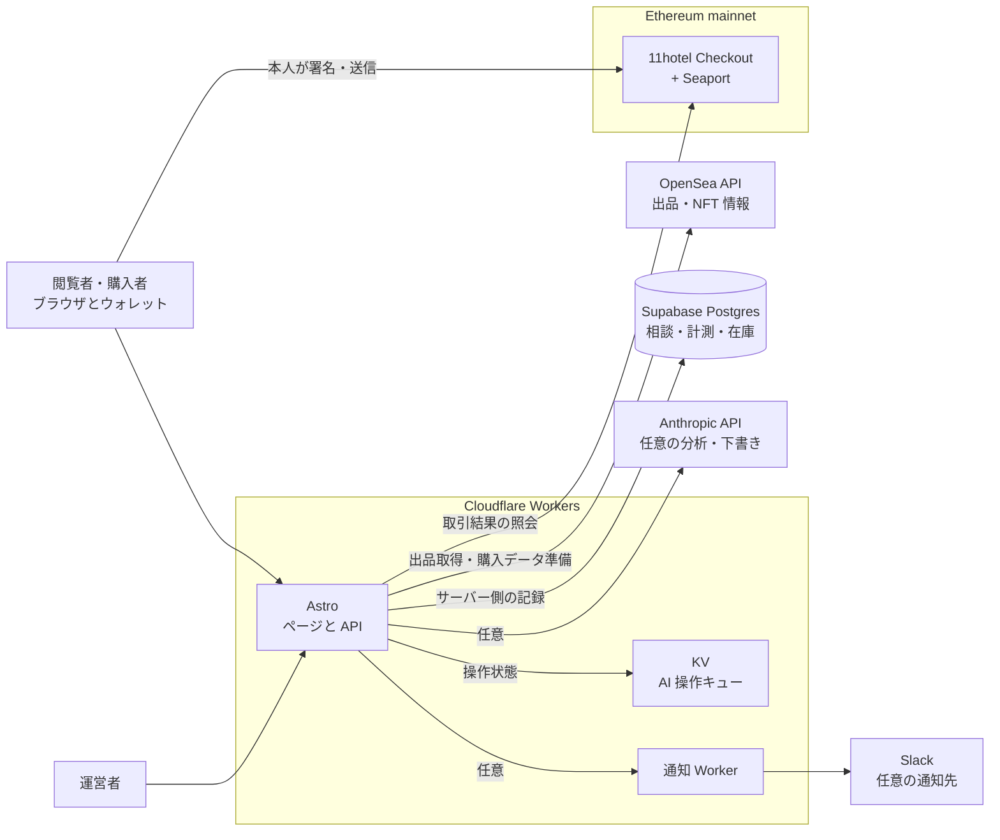
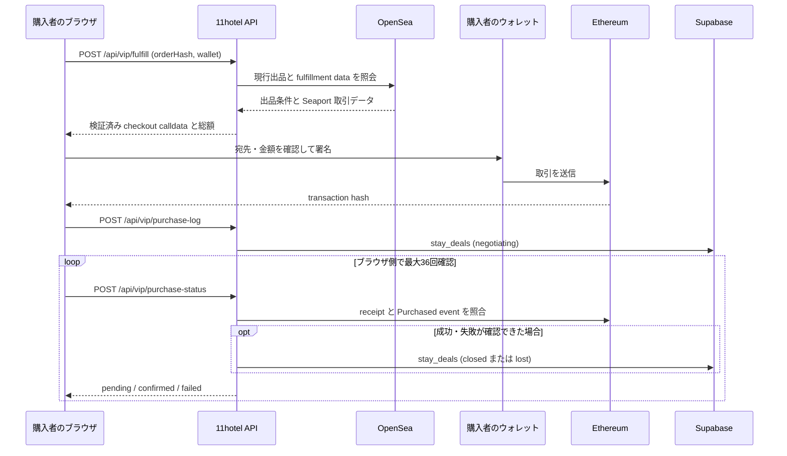
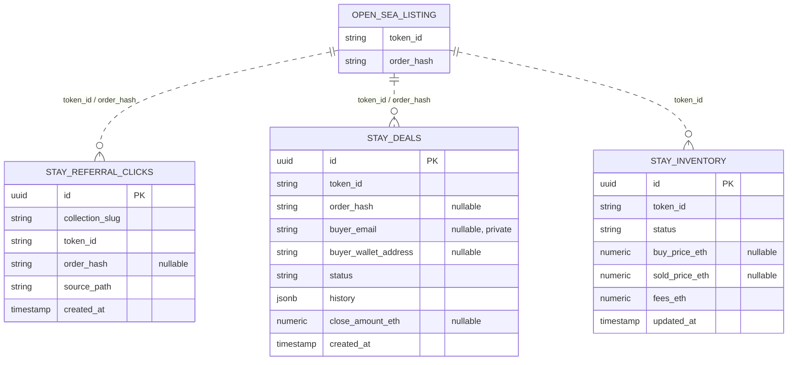

# 11hotel

> ホテルの価値を見つけ、伝え、未来につなぐ。

11hotel は、ホテル・リゾートの価値を「市場」と「編集」の両面から扱う事業です。現在は NOT A HOTEL の宿泊キー「THE KEY」のマーケットを中心に、宿泊したい人が公開出品を探し、購入を検討できる場を運営しています。中長期では映像・記事・写真の制作を通じてオーナーとの関係を築き、施設の承継・再生・運営、そして自社リゾートの開発へ進む構想です。

このリポジトリは [11hotel.vip](https://11hotel.vip/) の現行ソースコードです。

## 事業の全体像

| 領域 | 主な相手 | 提供する価値 | 収益・役割 | 現在地 |
| --- | --- | --- | --- | --- |
| **Market** | THE KEY の購入検討者・保有者 | 公開出品、宿泊日、拠点、取扱料込み価格の比較と購入サポート | 表示価格に含める取扱料。現在のサイトと収益検証の中心 | 現行サイトで提供 |
| **Editorial** | 宿泊者、施設、地域の関係者 | ホテル、建築、食、人、土地の価値を映像・記事・写真で伝える | 読者と施設からの信頼を築く。広告・タイアップは表示を明確にして扱う | 中長期の事業構想 |
| **Studio** | ホテル、旅館、ヴィラ、運営会社 | 施設の魅力を映像、写真、ブランドストーリーとして制作する | 制作・ブランディングの受託収益と施設との継続的な関係 | 事業設計中 |
| **Properties** | 施設オーナー、運営会社、買い手候補、専門事業者 | 売却・承継・再生の相談を非公開で整理し、適切な専門家につなぐ | Property Film・資料制作・再生支援など。正式な媒介や契約は有資格の提携先が担う | 将来の展開 |

### Market：現在の事業の入口

公開されている THE KEY の出品を集め、宿泊日・拠点・価格を見比べられるようにします。11hotel が表示するのは取扱料を含む総額です。購入者は自分のウォレットで内容を確認して署名し、購入後は NOT A HOTEL の公式アプリで利用条件を確認して有効化します。ウォレットや NFT に不慣れな人には、購入前の相談から有効化まで人が対応する方針です。

サイト内の購入フローでは、出品の取得、購入者へのキーの移転、11hotel の取扱料の支払いを同一のオンチェーン取引で処理します。いずれかが失敗した場合は取引全体が取り消される設計です。11hotel が代金やキーを継続して預かるモデルではありません。

### Editorial・Studio：施設の価値を伝える

Editorial では、建築・空間・食・人物・地域まで取材し、施設の背景と滞在する価値を伝えます。Studio ではその編集視点を、施設が Web・SNS・PR に使える制作物へ変えます。想定する制作商品は次のとおりです。

| 商品 | 想定する制作物 |
| --- | --- |
| **Hotel Essential** | 施設紹介映像、縦型動画、写真 |
| **Hotel Signature** | ブランドフィルム、オーナー・経営者インタビュー、写真と SNS 素材 |
| **Property Story** | 売却・承継を検討する施設の映像、写真、紹介記事、候補者向け資料 |

これらは事業設計上の商品です。制作の申込機能とホテルの編集アーカイブは、今後の公開機能として扱います。

### Properties：施設と土地を次へつなぐ

将来は、ホテル・旅館・ヴィラや用地について、オーナーからの相談を受け、建築・運営・地域との関係を含めて施設価値を整理します。公開の売買一覧ではなく、許可を得た情報を必要な相手に非公開で共有する方針です。媒介、重要事項説明、価格交渉、契約、法務・税務判断は提携する専門事業者が担います。

事業の展開は **Market で実際の需要と顧客接点をつくる → Editorial で理解と信頼を深める → Studio で施設との制作関係を築く → Properties で承継・再生を支える → 運営経験を蓄積し自社リゾートをつくる**、という順を想定しています。

## 現行サイトでできること

このリポジトリの実装は Market が中心です。Editorial・Studio・Properties は上記の事業方針であり、旧ホテル紹介ページや不動産相談機能は現在の公開版には含まれていません。

### 主な画面

| パス | 内容 |
| --- | --- |
| `/` | 出品中の宿泊キー、拠点、参考価格を紹介するトップページ |
| `/vip` | 出品の一覧・絞り込みができるマーケットボード |
| `/stay/[tokenId]` | 宿泊キーごとの詳細と購入フロー |
| `/vip/key/[tokenId]` | 特定の出品を開く共有用 URL（`/vip` に転送） |
| `/vip/keys` | 接続したウォレットが保有するキーの確認 |

公開出品は OpenSea のデータをサーバー側で取得します。取得できない場合、トップページは拠点紹介を表示します。購入、管理画面、一部の API を利用するには、対応する外部サービスと環境変数の設定が必要です。

## 技術構成

- Astro / TypeScript / Tailwind CSS
- Cloudflare Workers（Web アプリと API Worker）
- Supabase（データ保存）
- OpenSea API（出品情報）
- viem / WalletConnect（ウォレット接続と購入フロー）

## システム設計

11hotel は、公開ページと API を Astro のサーバーレンダリングアプリとして Cloudflare Workers 上で動かします。出品の最新情報は OpenSea、購入結果は Ethereum、相談・計測・運営記録は Supabase を参照します。運営者向けの AI 操作キューには Cloudflare KV を使い、通知用 Worker と Anthropic API は設定された場合にのみ利用します。



### 主な処理の流れ

| 処理 | 入力と処理 | 記録・結果 |
| --- | --- | --- |
| **出品表示** | `/api/vip/market` と `/api/stays/opensea` が OpenSea の出品・NFT 情報を取得し、画面用に整形する | 短時間キャッシュを使用。取得に失敗した場合は直近の正常データを返せる |
| **購入** | `/api/vip/fulfill` が現行出品と決済条件を再検証し、コントラクト用の取引データを返す | 購入者のウォレットが署名・送信。`purchase-log` が送信を記録し、`purchase-status` がチェーン上の結果を確認する |
| **購入相談** | `/api/stays/inquiry` が入力・同意を確認する | `stay_deals` に新規相談を保存し、設定済みなら運営者へ通知する |
| **運営管理** | `/admin` と `/api/admin/*` が相談・在庫・シグナルを扱う | `stay_deals` と `stay_inventory` を更新する。運営者自身の売買は記録であり、顧客資産の預かりではない |

購入フローでは、出品の表示後に再度サーバー側で出品を検証します。送信後の `stay_deals` はまず `negotiating` として保存され、確認済みのオンチェーン結果に応じて `closed` または `lost` に進みます。ブラウザからの送信記録だけで購入確定にはしません。



### データモデル（ER図）

この図は、このリポジトリのマイグレーションで定義する **THE KEY 関連の3テーブル** を示します。`OPEN_SEA_LISTING` は外部サービス上の概念であり、Supabase 内のテーブルではありません。点線は `token_id` や `order_hash` による論理的な対応で、データベースの外部キー制約ではありません。



- `stay_referral_clicks` は出品への流入計測、`stay_deals` は購入相談と購入の進捗、`stay_inventory` は運営者自身の仕入れ・出品・売却の記録です。同じ `token_id` に複数の記録があり得ます。
- これらのテーブルは RLS を有効化し、公開クライアント用ポリシーを付けない設計です。読み書きはサーバー側の service role を使う API と管理画面を経由します。`stay_deals` には連絡先が含まれるため、公開 API の応答に行全体を返しません。
- 管理ログ用の `admin_audit_logs` もコードから参照しますが、そのテーブル定義はこのリポジトリのマイグレーションに含まれていないため、図には含めていません。`202607300001_drop_legacy_editorial_hospitality.sql` は旧 Editorial / Hospitality テーブルの削除を定義します。図はソース上の目標モデルであり、本番環境への適用状態を保証するものではありません。

### 権限と運用の境界

- 公開の一覧 API は出品を読み取り、購入 API は入力・現行出品・コントラクト宛先と金額を検証します。購入の署名と送信は購入者のウォレットで行います。
- 管理 API は管理トークンの Cookie を確認し、状態を変えるリクエストでは `Origin` / `Referer` を検証します。AI ブリッジは別の Bearer トークンで保護します。
- `SUPABASE_SERVICE_ROLE_KEY`、`OPENSEA_API_KEY`、管理トークンなどはサーバー側の設定として扱います。`.env.example` は入力例です。本番のシークレットを Git に追加しないでください。
- Cloudflare へのデプロイと Supabase のマイグレーション適用は別の作業です。マイグレーションファイルが存在しても、本番データベースに反映済みとは限りません。

## ローカルで起動

Node.js と npm を用意し、リポジトリのルートで実行します。

```sh
npm ci
cp .env.example .env
npm run dev
```

`.env.example` を参考に、使う機能に必要な値を `.env` に設定してください。`.env` は Git の対象外です。公開出品の取得には `OPENSEA_API_KEY` が必要です。キーがない状態でも、トップページの拠点紹介は表示できます。

| 設定 | 用途 |
| --- | --- |
| `OPENSEA_API_KEY` | THE KEY の公開出品を取得 |
| `SUPABASE_URL` / `SUPABASE_SERVICE_ROLE_KEY` | サーバー側のデータ処理と管理機能 |
| `KEY_CHECKOUT_CONTRACT` / `KEY_COLLECTION_CONTRACT` | 購入フローで参照するコントラクト |
| `KEY_SUPPORT_FEE_BPS` / `KEY_NIGHTLY_FLOOR_ETH` | 取扱料と最低販売価格の設定 |
| `PUBLIC_WALLETCONNECT_PROJECT_ID` | モバイルなどでのウォレット接続 |
| `ADMIN_TOKEN` / `ADMIN_SECRET` | 管理機能の認証 |

`PUBLIC_` が付く値はブラウザから参照できます。それ以外の認証情報はサーバー側で扱い、リポジトリに追加しないでください。

## 開発コマンド

```sh
npm run dev            # 開発サーバー
npm run build          # 本番用ビルド
npm run test:checkout  # 購入フローのテスト
npm run test:security  # 公開 API のセキュリティテスト
```

主なコードは `src/`、公開アセットは `public/`、決済コントラクトは `contracts/`、データベースのマイグレーションは `supabase/migrations/` にあります。Cloudflare の設定は `astro.config.mjs`、`wrangler.toml`、`worker/` を参照してください。

## 運用上の境界

- THE KEY は宿泊のためのキーとして扱い、値上がりや転売益を訴求しません。出品価格や参考価格は投資助言ではなく、在庫・価格・宿泊条件を保証するものでもありません。
- 11hotel は宿泊予約の確定や、許可を要する不動産の媒介・契約業務を行いません。購入前には NOT A HOTEL の公式案内と利用条件を確認してください。
- AI は調査・分類・要約・下書きの補助に使います。外部への送信、公開、価格や契約に関わる判断は人が確認します。
