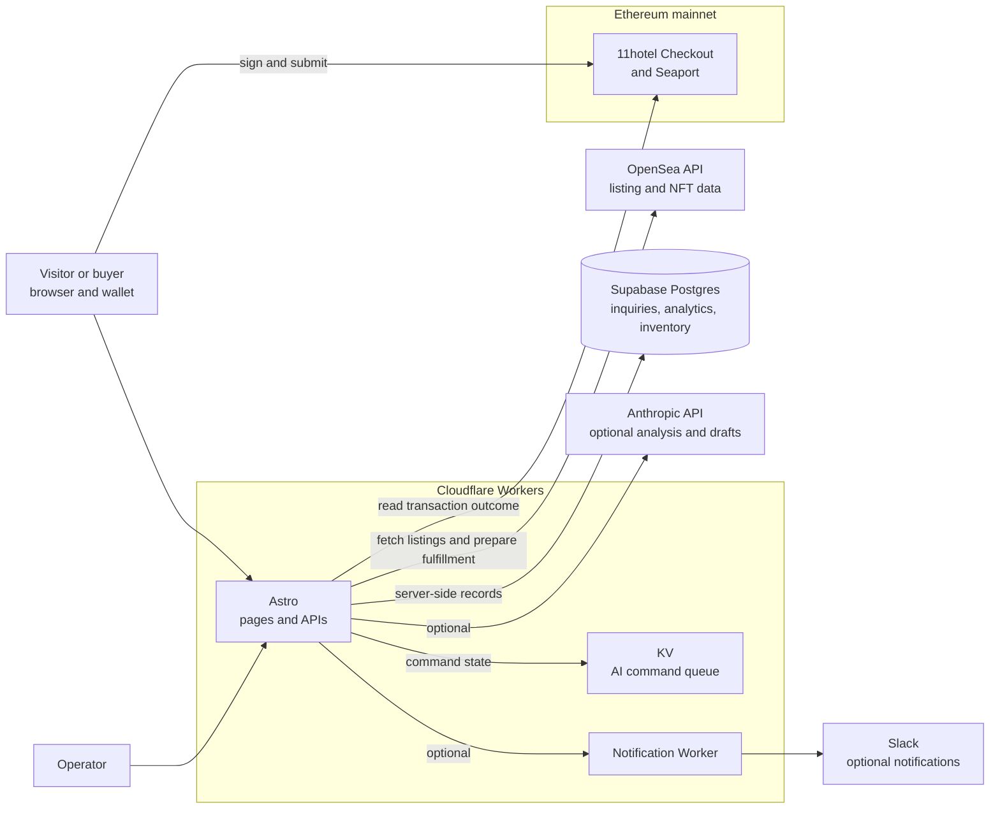
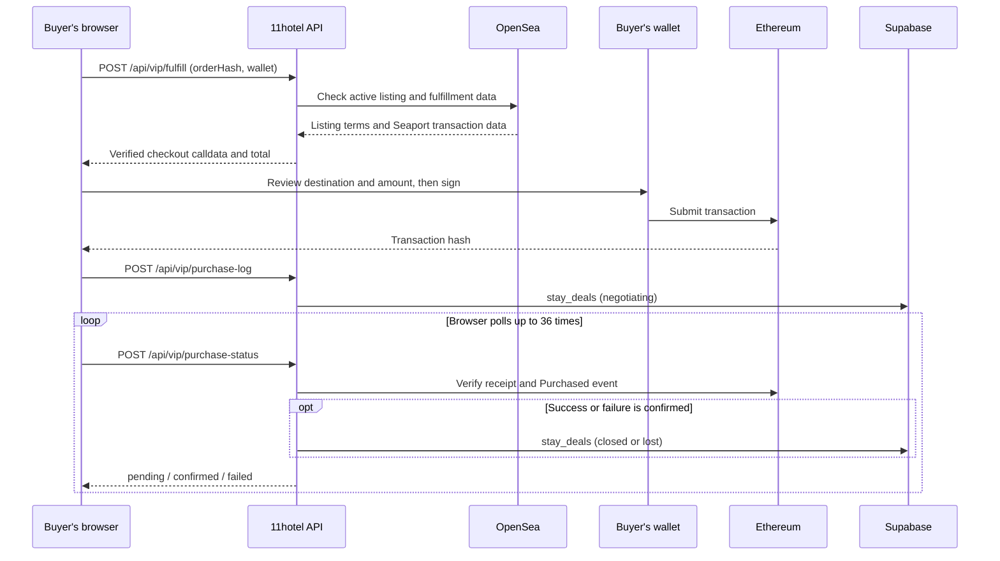
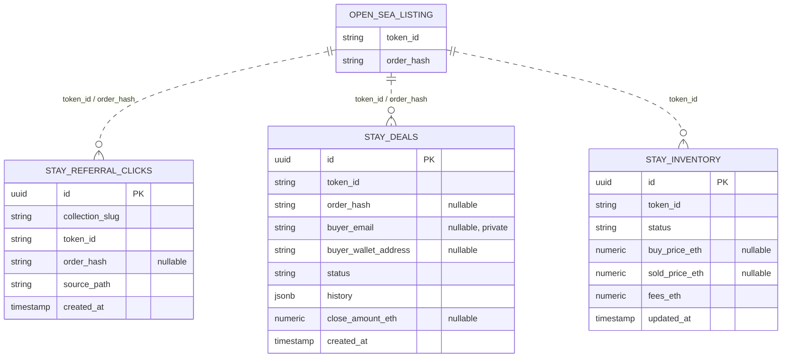

# 11hotel

> Discover the value of hotels, tell their stories, and carry them forward.

11hotel is a hospitality business built around both a marketplace and editorial storytelling. Today, its main product helps people explore public listings for THE KEY, a stay key from NOT A HOTEL, and consider a purchase. Over time, 11hotel aims to build relationships with property owners through film, photography, and writing, then expand into property succession, revitalization, operations, and eventually its own resorts.

This repository contains the current source code for [11hotel.vip](https://11hotel.vip/).

## Business overview

| Area | Primary audience | Value offered | Revenue or strategic role | Status |
| --- | --- | --- | --- | --- |
| **Market** | Prospective buyers and holders of THE KEY | Compare public listings by stay date, location, and total price, with purchase support | Service fee included in the displayed total; the focus of the current site and revenue validation | Available on the current site |
| **Editorial** | Travelers, properties, and local communities | Tell the stories of hotels, architecture, food, people, and places through film, articles, and photography | Build trust with readers and properties; clearly disclose advertising and sponsored work | Longer-term plan |
| **Studio** | Hotels, ryokan, villas, and operators | Produce films, photographs, and brand stories that communicate a property's appeal | Production and branding fees, plus ongoing property relationships | In design |
| **Properties** | Property owners, operators, prospective buyers, and specialists | Organize confidential conversations about sales, succession, and revitalization, then connect the right professionals | Property films, presentation materials, and revitalization support; licensed partners handle regulated brokerage and contracts | Future expansion |

### Market: the current starting point

The site brings together public listings for THE KEY so visitors can compare stay dates, locations, and prices. 11hotel displays a total that includes its service fee. Buyers review and sign the transaction with their own wallets. After purchase, they check the terms and activate the key through NOT A HOTEL's official app. The intended support experience includes human help before purchase and through activation for people unfamiliar with wallets or NFTs.

The on-site purchase flow is designed to purchase the listed key, transfer it to the buyer, and pay 11hotel's service fee in one on-chain transaction. If any part fails, the entire transaction reverts. 11hotel does not continuously hold the buyer's funds or key.

### Editorial and Studio: communicating a property's value

Editorial covers architecture, spaces, food, people, and local culture to explain a property's background and the experience of staying there. Studio turns that editorial perspective into assets a property can use on the web, social media, and in public relations.

| Planned offering | Intended deliverables |
| --- | --- |
| **Hotel Essential** | Property introduction film, vertical videos, and photographs |
| **Hotel Signature** | Brand film, owner or executive interview, photographs, and social media assets |
| **Property Story** | Film, photographs, article, and buyer-facing materials for a property considering sale or succession |

These are planned offerings. Production inquiries and an editorial hotel archive are not yet features of the current site.

### Properties: carrying places forward

In a future phase, 11hotel intends to work with owners of hotels, ryokan, villas, and potential development sites. It would document a property's value, including its architecture, operations, and relationship with the local area. The plan is to share owner-approved information privately with relevant parties rather than publish an open property sales board. Licensed partners would handle brokerage, required disclosures, price negotiations, contracts, and legal or tax advice.

The intended progression is **Market** (learn from real demand and meet customers), followed by **Editorial** (build understanding and trust), **Studio** (develop working relationships with properties), and **Properties** (support succession and revitalization). Operating experience from these stages would inform the creation of 11hotel resorts.

## What the current site does

The implementation in this repository is centered on Market. Editorial, Studio, and Properties describe the business direction. The earlier hotel editorial pages and property inquiry features are not part of the current public release.

### Main routes

| Route | Purpose |
| --- | --- |
| `/` | Homepage introducing listed stay keys, locations, and reference prices |
| `/vip` | Market board with listing filters |
| `/stay/[tokenId]` | Details and purchase flow for a stay key |
| `/vip/key/[tokenId]` | Shareable listing URL that redirects to `/vip` |
| `/vip/keys` | Keys held by a connected wallet |

The server fetches public listings from OpenSea. If they are unavailable, the homepage can still show its location overview. Purchases, administration, and some APIs require the relevant external services and environment variables.

## Technology

- Astro, TypeScript, and Tailwind CSS
- Cloudflare Workers for the web app and notification API
- Supabase for operational data
- OpenSea API for listing and NFT data
- viem and WalletConnect for wallet connectivity and the purchase flow

## System design

11hotel runs its public pages and APIs as a server-rendered Astro application on Cloudflare Workers. OpenSea provides current listing data, Ethereum provides the authoritative purchase outcome, and Supabase stores inquiries, analytics, and operator records. Cloudflare KV holds the operator-facing AI command queue. The notification Worker and Anthropic API are used only when configured.



### Core flows

| Flow | Input and processing | Record or result |
| --- | --- | --- |
| **Listing display** | `/api/vip/market` and `/api/stays/opensea` fetch and format OpenSea listings and NFT metadata | Short-lived caches; the last successful payload can be served if a refresh fails |
| **Purchase** | `/api/vip/fulfill` rechecks the active listing and payment conditions, then returns checkout transaction data | The buyer's wallet signs and submits; `purchase-log` records submission and `purchase-status` checks the on-chain result |
| **Purchase inquiry** | `/api/stays/inquiry` validates the request and consent | Creates a `stay_deals` record and optionally notifies the operator |
| **Operations** | `/admin` and `/api/admin/*` handle inquiries, inventory, and market signals | Update `stay_deals` and `stay_inventory`; the inventory tracks the operator's own positions rather than customer assets |

The server revalidates a listing after it has been displayed and before it prepares a purchase. A submitted transaction is first recorded in `stay_deals` as `negotiating`. It moves to `closed` or `lost` based on the verified on-chain outcome. A browser submission alone does not mark a purchase as complete.



### Data model (ER diagram)

This diagram covers the **three THE KEY tables** defined by migrations in this repository. `OPEN_SEA_LISTING` is a concept in an external service, not a Supabase table. Dotted edges show logical matches through `token_id` or `order_hash`; they are not database foreign key constraints.



- `stay_referral_clicks` records listing referral activity; `stay_deals` tracks inquiries and purchase progress; `stay_inventory` records purchases, listings, and sales made by the operator. Multiple records may refer to the same `token_id`.
- The migrations enable row-level security (RLS) on these tables without adding public-client policies. Reads and writes go through server-side APIs and admin pages using the service role. Because `stay_deals` contains contact information, public API responses do not return entire rows.
- The code also references `admin_audit_logs`, but its table definition is not included in this repository's migrations, so it is omitted from the diagram. `202607300001_drop_legacy_editorial_hospitality.sql` defines removal of older Editorial and Hospitality tables. The diagram describes the source-controlled target model; it does not prove which migrations have been applied in production.

### Access and operating boundaries

- Public listing APIs read listings. The purchase API validates input, the active listing, the contract destination, and amounts. The buyer signs and submits the transaction from their own wallet.
- Admin APIs check an admin-token cookie and validate `Origin` or `Referer` on state-changing requests. The AI bridge uses a separate bearer token.
- `SUPABASE_SERVICE_ROLE_KEY`, `OPENSEA_API_KEY`, admin tokens, and similar credentials belong in server-side configuration. `.env.example` contains examples. Do not commit production secrets.
- Deploying to Cloudflare and applying Supabase migrations are separate operations. A migration file in this repository does not mean it has been applied to the production database.

## Run locally

Install Node.js and npm, then run the following commands from the repository root:

```sh
npm ci
cp .env.example .env
npm run dev
```

Use `.env.example` to set the values needed by the features you want to run. `.env` is ignored by Git. `OPENSEA_API_KEY` is required to fetch public listings; without it, the homepage can still display its location overview.

| Variable | Purpose |
| --- | --- |
| `OPENSEA_API_KEY` | Fetch public THE KEY listings |
| `SUPABASE_URL` / `SUPABASE_SERVICE_ROLE_KEY` | Server-side data processing and admin features |
| `KEY_CHECKOUT_CONTRACT` / `KEY_COLLECTION_CONTRACT` | Contracts used by the purchase flow |
| `KEY_SUPPORT_FEE_BPS` / `KEY_NIGHTLY_FLOOR_ETH` | Service-fee and minimum-price configuration |
| `PUBLIC_WALLETCONNECT_PROJECT_ID` | Wallet connections, including mobile |
| `ADMIN_TOKEN` / `ADMIN_SECRET` | Admin authentication |

Variables prefixed with `PUBLIC_` are available to browser code. Keep all other credentials on the server and out of the repository.

## Development commands

```sh
npm run dev            # Start the development server
npm run build          # Build for production
npm run test:checkout  # Test the purchase flow
npm run test:security  # Test public API security checks
```

Application code is in `src/`, public assets in `public/`, checkout contracts in `contracts/`, and database migrations in `supabase/migrations/`. See `astro.config.mjs`, `wrangler.toml`, and `worker/` for Cloudflare configuration.

## Operating principles

- THE KEY is treated as a key for stays. 11hotel does not promote price appreciation or resale gains. Listing and reference prices are not investment advice, and availability, pricing, or stay conditions are not guaranteed.
- 11hotel does not confirm lodging reservations or perform regulated real-estate brokerage and contract services. Review NOT A HOTEL's official guidance and terms before purchasing.
- AI helps with research, classification, summaries, and drafts. A person reviews external messages, publication, and decisions involving prices or contracts.
